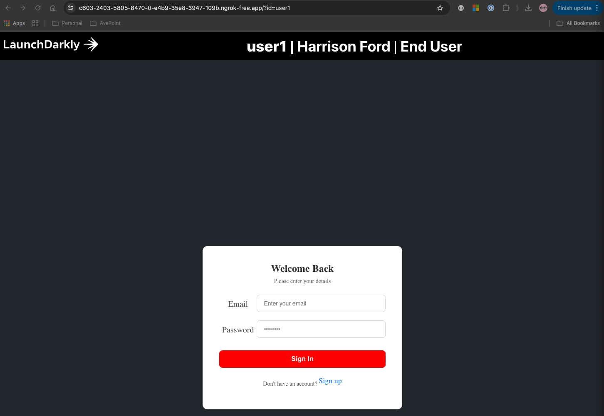
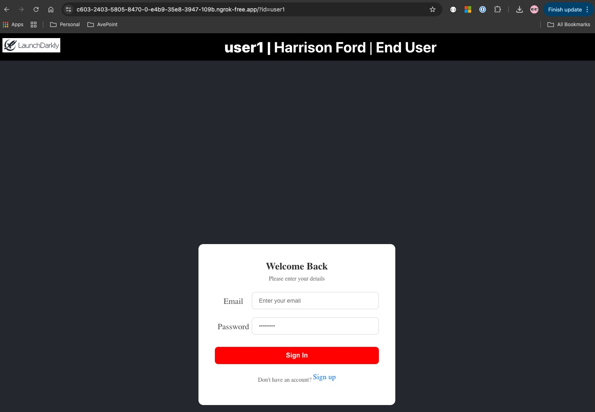
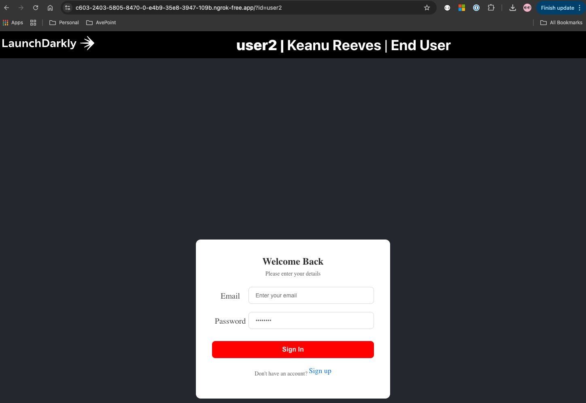
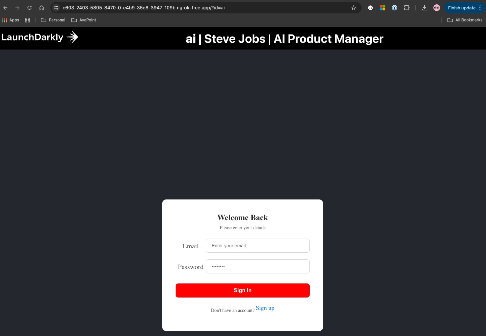
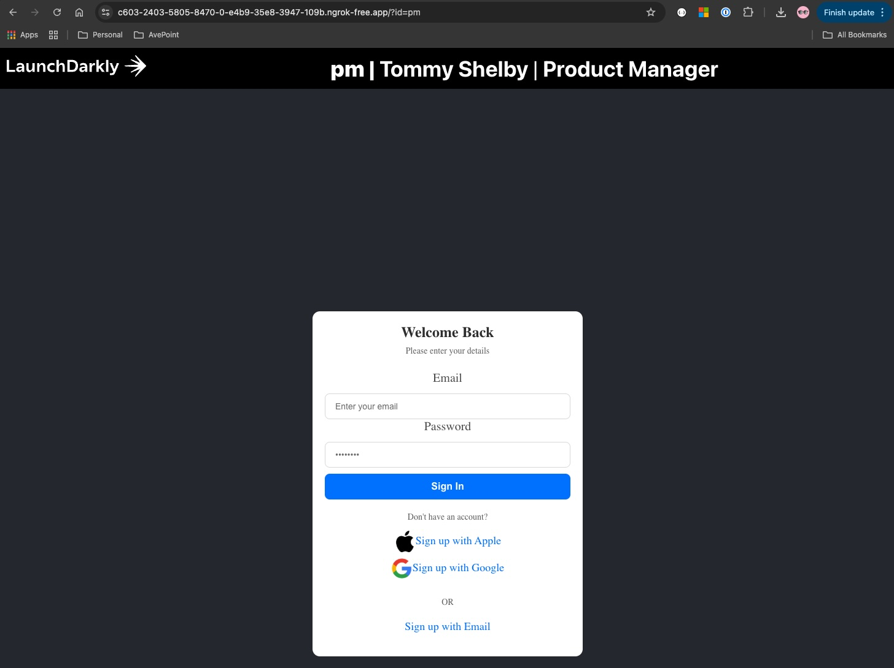
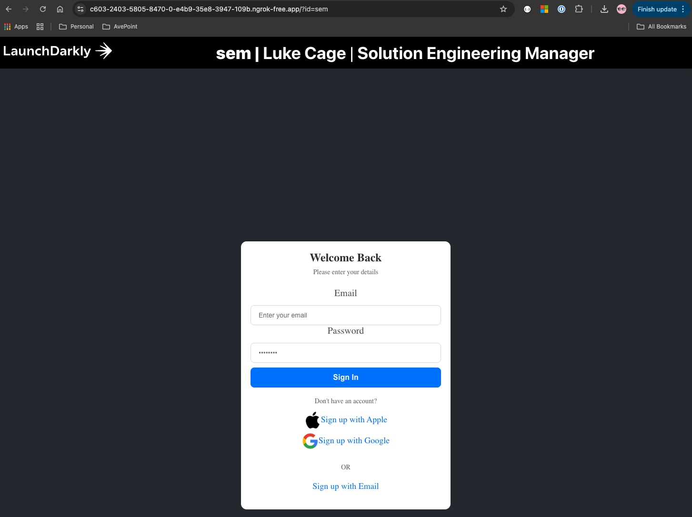
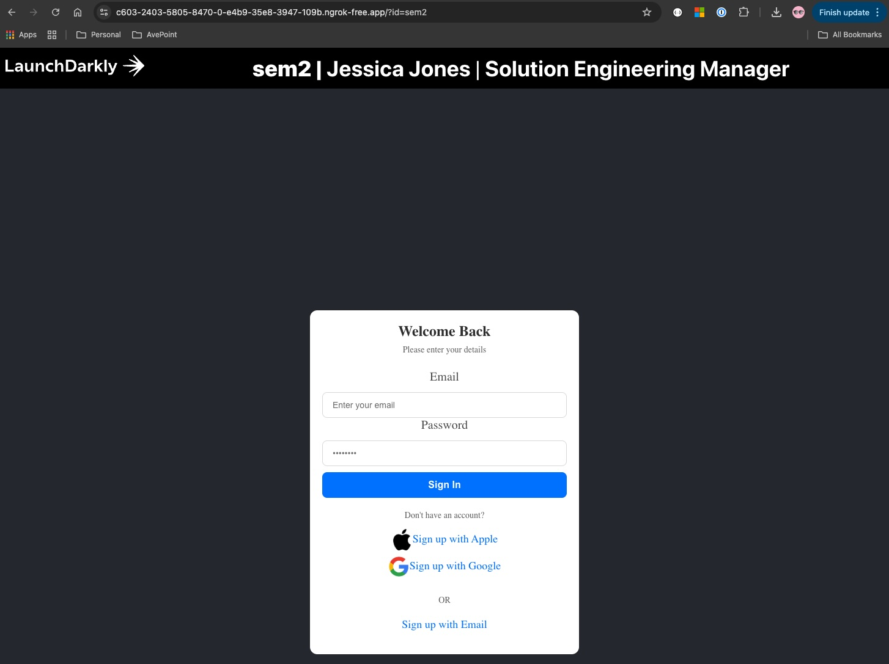
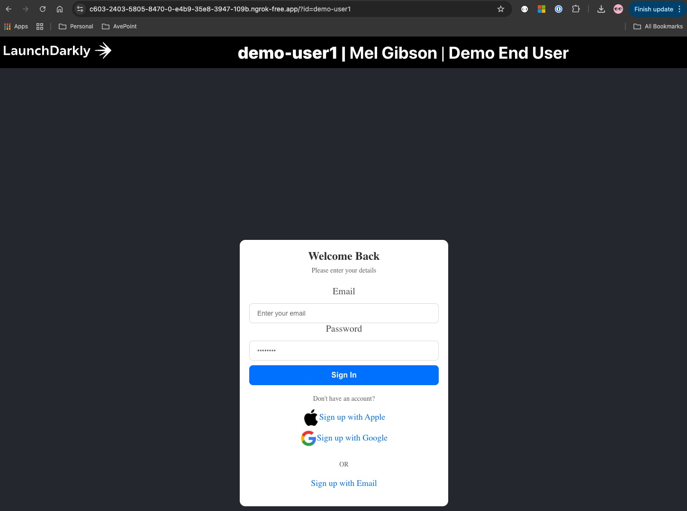
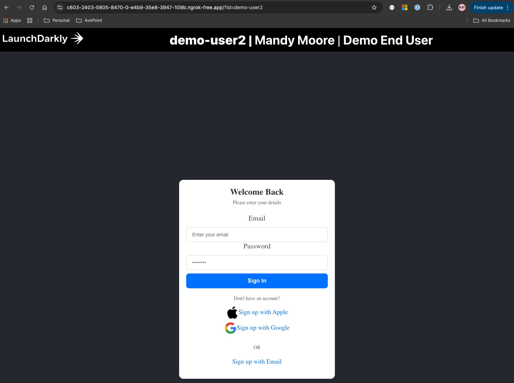
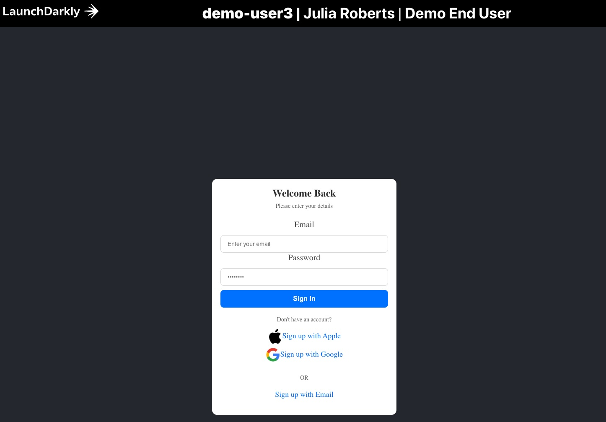

## Web Application

## User key: user1
`newLogo` flag manually turned ON and `newLogIn` turned OFF

`newLogo` flag manually turned OFF and `newLogIn` turned OFF

## User key: user2
`newLogo` flag manually turned ON and `newLogIn` turned OFF

## User key: ai
`newLogo` flag manually turned ON and `newLogIn` turned OFF

## User key: pm
`newLogIn` individual target `Tommy Shelby` and `newLogo` turned ON

## User key: sem
`newLogIn` flag rule-based `title is Solution Engineering Manager` and `newLogo` turned ON

`newLogIn` flag rule-based `title is Solution Engineering Manager` and `newLogo` turned ON

## User key: demo-user1
`newLogIn` flag rule-based `title is Demo End User` and `newLogo` turned ON

## User key: demo-user2
`newLogIn` flag rule-based `title is Demo End User` and `newLogo` turned ON

## User key: demo-user3
`newLogIn` flag rule-based `title is Demo End User` and `newLogo` turned ON
